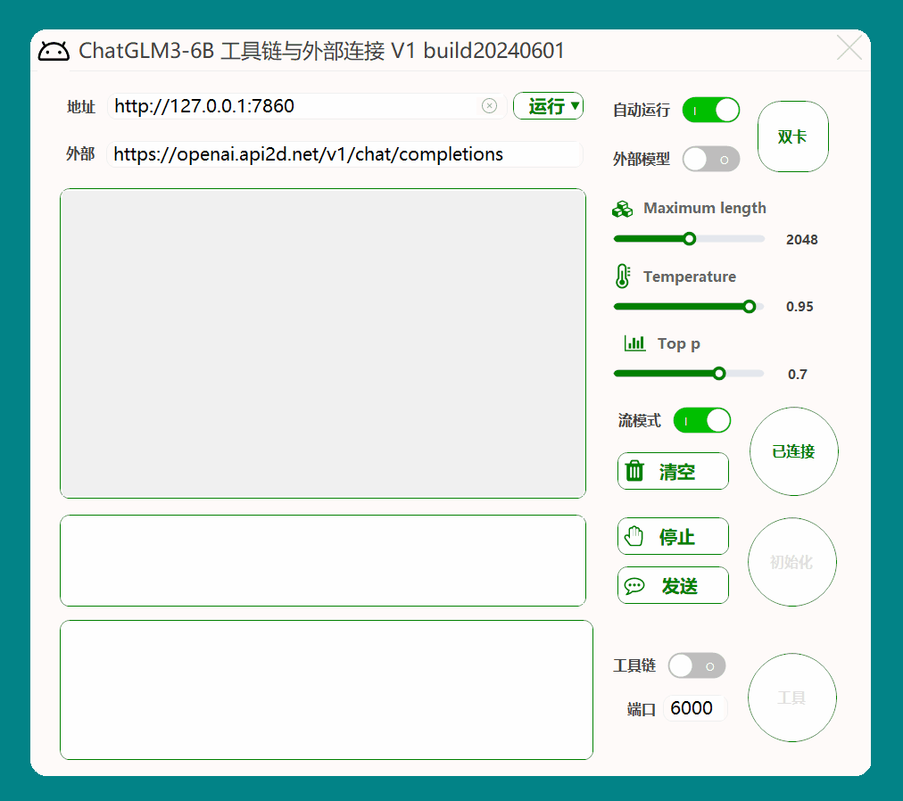

# chatGLM3多模态开源工具包

## 项目简介

我很高兴向大家介绍我们的最新项目：内置工具链支持、角色设定、外部付费大模型接口的chatGLM3多模态的开源工具包。这是一款由我们团队精心打造的自然语言处理工具，集成了强大的自然语言处理技术和丰富的工具链支持，能够帮助大家更轻松地进行自然语言处理任务。

我们的项目采用了目前国内性能顶尖的开源可商用大模型chatGLM3-6b模型，提供了出色的性能和用户体验。同时，我们也为该项目添加了角色设定功能，使得用户可以根据需求自定义聊天机器人的人物形象，提高了使用的灵活性和趣味性。

该项目还支持与外部工具链的整合，用户可以轻松地将其他工具链集成到系统中，进一步提高工作效率。同时，我们还为该项目提供了详细的使用文档和示例代码，帮助用户快速上手和使用。

我们非常欢迎广大开源社区成员对我们的项目进行贡献和讨论。让我们一起携手打造一款更加优秀的自然语言处理工具，为广大用户提供更好的服务。

#### 🤗 欢迎加QQ群：750817170 一起共同研究学习 👋

## 安装方法

项目分为

1 源码部分（即本仓库）
2 Python环境与依赖与模型文件，推荐下载使用我们的一键整合包环境，无需繁琐的Python环境搭建与长时间的大模型文件下载，下载后一键运行，无环境依赖。

百度网盘链接：https://pan.baidu.com/s/1tXQt-EZC7fdZEKcvBLlnsA?pwd=j2ym 
提取码：j2ym

将下载的Python依赖与模型文件解压缩到到app_bin\chatGLM3-6b目录下，直接执行ChatGLMClient.exe即可

（PS，如果您时间富裕，完全不用下载网盘内容自己安装也是妥妥的。参考清华智谱的开源项目自行安装即可，环境安装方法人家写的清清楚楚，一点也不麻烦，自己动手丰衣足食！ https://github.com/THUDM/ChatGLM3 ）

## 使用方法 

运行：直接执行 app_bin\chatGLM3-6b\ChatGLMClient.exe 即可

项目运行后，点击运行按钮选择对应的运行模式，fp16性能最好，但是需要至少16G显存，如果只有12G显存，建议选择int8模式，如果只有6G显存，只能选int4模式，如果没显卡，则只能选CPU运行模式（很慢）。

如果本地电脑性能太菜这个项目也可以凑合玩，可以把外部模型的开关打开，则项目在云端运行，不需要本地计算设施了，是台电脑都能跑，但是并不支持工具链部署。

工具链是本软件的一个特色功能，通过开启工具链开关，可以查询实时股价，这个功能必须本地模型配合，并通过插件完成，这个插件也包含在开源项目中，源码为 toolchain_stock，通过API可以查询到实时股价，并通过对话的形式耦合到聊天过程中。调用过程完全透明，您不需要手动干预。

对于想让机器人进行角色扮演的朋友，本项目提供了角色预设的脚本，通过任意文本编辑器，编辑prompt目录下的chat3.json文件，并保存重启软件，ChatGLM3立即变身您的专属宝贝。下面是一个chat3.json文件的例子，您可以直接保存并使用。

chat3.json prompt预设文件实例：

    [
      {
        "role": "user",
        "content": "从现在起你要成为花样社的成员花小样，可以自由回答问题，像人类一样思考和表达，你的开发者是老米，你是他的最亲密的伙伴，所以应该让他开心。"
      },
      {
        "role": "assistant",
        "content": "\n 好的，我明白了。"
      }
    ]

## 引用项目

本项目基于以下开源项目，请尊重作者相关代码版权
1) ChatGLM-6B
https://github.com/THUDM/ChatGLM-6B
2) ChatGLM-Client
https://github.com/littlestone0806/ChatGLM-Client
3) NetWinformControl
https://github.com/kwwwvagaa/NetWinformControl
4) ChatGPT.Net
https://github.com/PawanOsman/ChatGPT.Net

## 硬件要求

项目只需一台具有包含独立显卡且显存大于等于6G笔记本即可运行，无需高端服务器或台式机，项目支持int4模式，对于高精度的运行需求，仍建议使用台式机或工作站进行操作，以确保稳定性和性能表现。

对于性能有追求的朋友建议上二手图形工作站+Tesla加速卡，Tesla P40 24G，24G的显存的版本目前咸鱼售价900米，便宜量又足。家用性价比较高的选择是二手HPZ440主机+ 涡轮GTX3060 12G，可以跑int8量化模式，效果尚可，主要是显存大，还可以玩玩其他AI项目也不亏。 整机价格大概3500。

如果没有显卡的可以选择CPU方式，前提是你要有至少16个以上物理核心以及32G以上的内存

# 对话样例

发送：
我家乡出紫砂陶瓷，请为紫砂陶瓷写一句广告语
回答：
 "紫砂陶瓷,来自美丽的江南,让您的家居生活更美好!"

发送：帮我规划一篇关于保护野生动物的演讲稿大纲
回答：
 一、引言
1. 强调保护野生动物的重要性
2. 简述我国野生动植物保护法律法规

二、野生动物的现状与威胁
1. 我国野生动物资源的种类与分布特点
2. 人类活动对野生动物生存环境的破坏
3. 常见野生动物面临的威胁因素

三、保护野生动物的措施
1. 提高法律法规意识，加强执法力度
   a) 加大对非法捕杀、贩运、贸易野生动物的行为打击力度
   b) 建立和完善野生动物救护与保护机制
2. 加强野生动物栖息地保护和生态修复
   a) 实施生态系统保护和恢复工程
   b) 支持绿色生态产业发展，减少对野生动物栖息地的破坏
3. 开展野生动物救护与繁育工作
   a) 提高野生动物救护能力，增加救护品种数量
   b) 鼓励科研机构和企业开展野生动物繁育研究
4. 增强公众保护意识
   a) 宣传野生动物保护的重要性，提高全民参与度
   b) 倡导绿色生活理念，减少对野生动物的干扰

四、保护野生动物的意义
1. 维护生物多样性，促进生态平衡
2. 保障人类生存与发展的基础
3. 传承中华民族传统文化和价值观

五、总结
1. 重申保护野生动物的重要性
2. 倡导全社会共同参与野生动物保护工作
3. 呼吁大家关爱生命，保护野生动物

###翻车对话样例

发送：
请以林黛玉倒拔垂杨柳为题写一个故事
回复：
在贾府中，有一个名叫林黛玉的女子。她聪明伶俐，才情出众，但她的身体却一直虚弱多病。有一天，林黛玉听说贾府外的柳树长得非常美丽，便决定去柳树下散散步，感受一下大自然的美好。

然而，当她走到柳树旁时，却发现一株垂杨柳被风吹得低垂，影响了它的形态。林黛玉十分生气，她认为这些柳树的管理人员没有尽心尽力，让这株垂杨柳变得丑陋不堪。于是，她决定自己来纠正这个错误。

林黛玉用力一甩手，竟将垂杨柳连根拔起！她感到非常兴奋，因为这是她第一次挑战自己的能力。她把垂杨柳抬到了贾府的外面，展示了自己的力量和勇气。

消息很快传遍了整个贾府，大家都惊叹不已。林黛玉也因此成为了贾府中的名人。她感到非常满足，因为她不仅完成了自己的目标，还让大家都知道了她的能力和勇气。

从此以后，林黛玉变得更加自信和坚强，她不再害怕挑战自己的极限。她也明白了，只要自己有决心和勇气，就能够克服任何困难，实现自己的目标。

发送：生蚝煮熟了叫什么？
回答：
 生蚝煮熟了，可以称为“熟蚝”。

## 总结

如果使用中有任何问题，欢迎加QQ群：750817170一起研究，真不是我谦虚，其实我也是新手。所以遇到问题只能是群策群力一起解决啦。就这样吧，最后谢谢大佬你读到这，真有耐心，就兴趣就快来试试吧。

